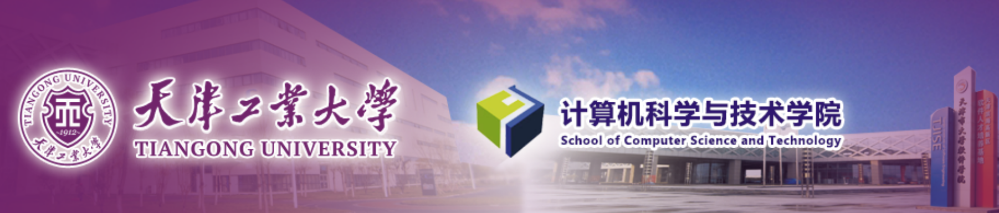

  

*目前正在中山大学系统科学与工程学院攻读博士学位！* 
**I'm currently pursuing an Engineering Doctor  degree in Computer Science and Technology
at the School of Systems science and Engineering, Sun Yat-sen University, Guangzhou, China.**
 
<!--**居住地 |&ensp; Current Residence： 广东 - 广州 |&ensp;  Guangdong - Guangzhou**   
#### Email  
<code>xinpx1457@163.com</code>  
<code>guogx5@mail2.sysu.edu.cn</code>  
<code>guo.ggxin1457@gmail.com</code>
#### Personal Website  

<a href="https://orcid.org/0000-0002-3080-9244"> [ORCID] </a>

<a href = "https://scholar.google.com/citations?user=A5YN3oUAAAAJ&hl=en" >[Google Scholar]</a>

<a href="https://www.researchgate.net/profile/Guangxin-Guo-4?ev=hdr_xprf"> [ResearchGate]</a>-->

 <table border="0"> <!-- border="0" 用于显示边框，实际开发中推荐使用CSS来控制样式 -->
    <tr>
        <th>Basic Information</th>
        <th> Email  </th>
        <th>Personal Website  </th>
    </tr>
    <tr>
        <td>籍贯 |&ensp;  Place of Origin： 山东 - 济宁 |&ensp;  Shandong - Jining   </td>
        <td>xinpx1457@163.com</td>
        <td><a href="https://orcid.org/0000-0002-3080-9244"> [ORCID] </a></td>
    </tr>
   <tr>
        <td>居住地 |&ensp; Current Residence： 广东 - 广州 |&ensp;  Guangdong - Guangzhou</td>
        <td>guogx5@mail2.sysu.edu.cn</td>
        <td><a href = "https://scholar.google.com/citations?user=A5YN3oUAAAAJ&hl=en" >[Google Scholar]</a></td>
    </tr>
   <tr>
        <td>年龄 |&ensp; Age： 27 </td>
        <td>guo.ggxin1457@gmail.com</td>
        <td><a href="https://www.researchgate.net/profile/Guangxin-Guo-4?ev=hdr_xprf"> [ResearchGate]</a></td>
    </tr>
</table>

#### Education  

**
Sun Yat-sen University,School of Systems science and Engineering** 

*Engineering Doctor of Electronic Information (2024 9 – 2028 6)*  
**Graduate Supervisor:** **Prof. Xiao Shaoqiu |&ensp; 肖绍球**   
**Core Courses:**  
Operations Research  |&ensp;  运筹学 
Introduction to Unmanned Systems |&ensp;  无人系统概论
Optimal Control |&ensp;  最优控制
Frontiers in Deep Learning |&ensp;  深度学习前沿  

**
Tiangong University, School of  Computer Science and Technology
**
*Master of  Computer Science and Technology (2020 9 – 2023 3)*   
**Graduate Supervisor:** **Prof. Zhao Zhanshan |&ensp; 赵占山**  
**Core Courses:**  
Machine Learning |&ensp; 机器学习, Advanced Algorithms |&ensp; 现金算法, Computer Vision |&ensp; 计算机视觉,
Principles and Applications of Artificial Intelligence |&ensp; 人工智能原理及应用, Cryptography |&ensp; 密码学,
Matrix Theory |&ensp; 矩阵论, Numerical Analysis |&ensp; 数值分析, Combinatorics |&ensp; 组合数学, 
Principles of Automatic Control |&ensp; 自动控制原理, Linear Systems |&ensp; 线性系统, Nonlinear Systems Control |&ensp; 非线性系统控制  

**
Jining University, School of  Computer Science and Engineering
**
*Bachelor of  Computer Science and Technology  (2018 9  – 2020 6)*  
**Core Courses:**  
Advanced Mathematics |&ensp; 高等数学, Probability Theory |&ensp; 概率论, Linear Algebra |&ensp; 线性代数, 
C/C++ Programming |&ensp; C/C++ 语言, Data Structures |&ensp; 数据结构, Operating Systems |&ensp; 操作系统,
Microcomputer Principles |&ensp; 微机原理, Computer Organization and Architecture |&ensp; 计算机组成原理, 
Computer Networks |&ensp; 计算机网络, Robotics |&ensp; 机器人学   

#### 
 Research Interests   

* Sliding Mode Control |&ensp; 滑模控制, 
* Nonlinear Control, |&ensp; 非线性控制
* Multi-agent Systems Consensus, |&ensp; 多智能体系统一致性
* Autonomous Vehicle, |&ensp; 自主车辆
* Adaptive Control, |&ensp; 自适应控制
* State Observer/ Disturbance Observer, |&ensp; 状态观测器/ 扰动观测器
* Reinforcement learning, |&ensp; 强化学习
* Neural Network, |&ensp; 神经网络
* Robot Formation, |&ensp; 机器人编队
* Fixed-time Stability |&ensp; 固定时间稳定
* Predefined-time Stability |&ensp; 预定时间稳定
.